# TravelOptimizer

**Project:** The goals of this project was to develop an application that empowered everyday travellors to reach one destination to another in the most optimal way possible. The application leverages the Google Maps API to create an environmet where the user specifies where they want to go - from beginning of the journey to end, the budget they have to travel there and and the vehicle they are using to travel with. The application uses the current gas pricing, vehicle fuel consumption and provides the best 4 options (if all available) to reach a particular destination. The Algorithm developed involves looking at all the current options and formulating the top 4 for the user to reach their destination without going over budget.

**Walkthrough**:

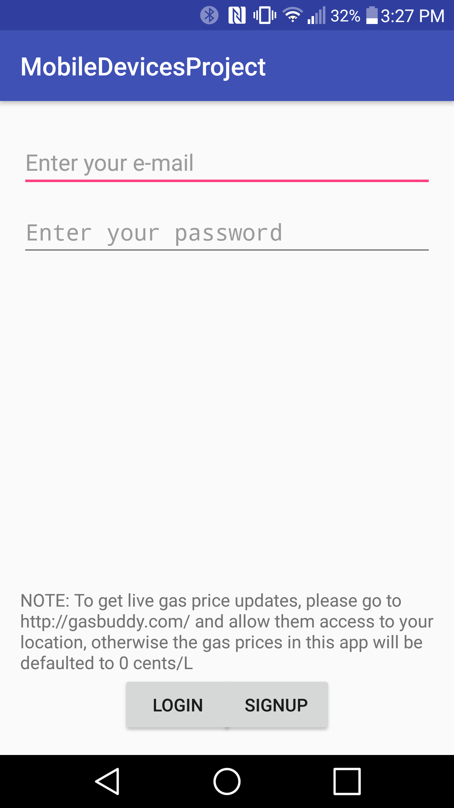
 
**Figure 1:** If the user is not already, registered in the application, they must register their informatio by clicking Sign-Up at the bottom of the page.

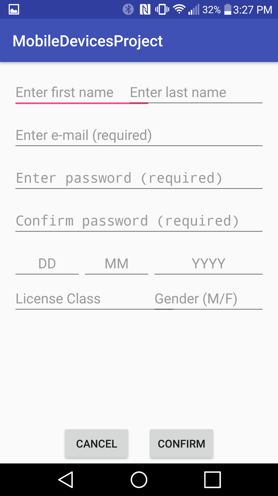
 
**Figure 2:** The user will input all the necessary fields inside the application to sign-up.

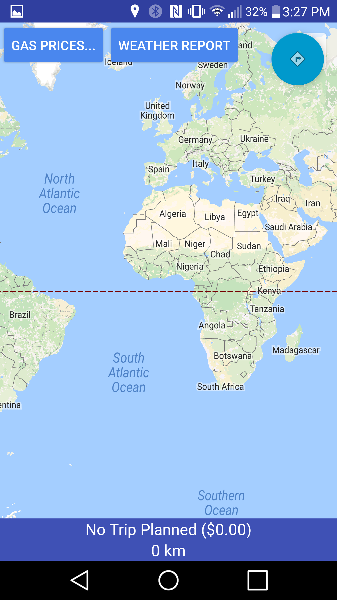
 
**Figure 3:** Once the user logs in, they will be taken to the main Map on the page. If they would like to plan a trip they will simply click the top right button on the Map screen.

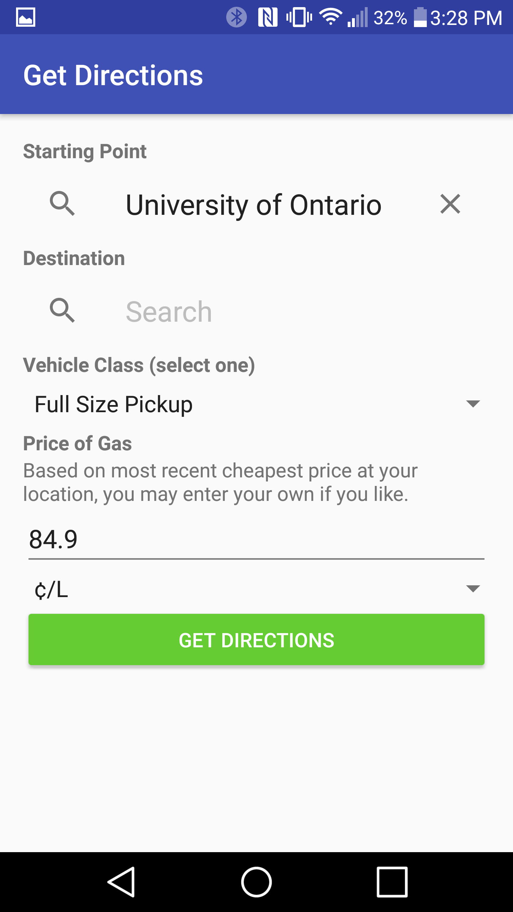
 
**Figure 4:** The user will then be asked to input the start and end-point of the destination which calls the Google API to allow the user to search worldwide. 

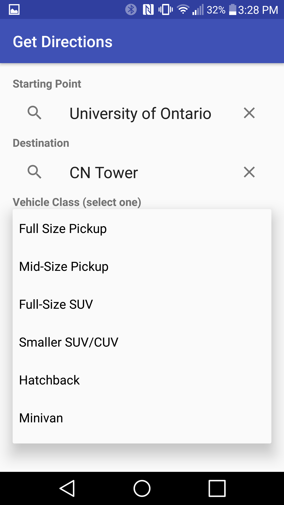
 
**Figure 5:** The user will then enter the destination along with the type of vehicle they drive. This information is stored inside the database which was collected on car dealership sites. 

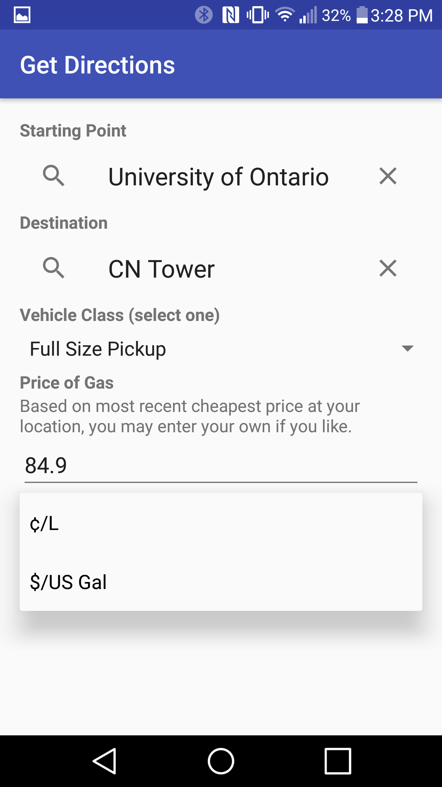
 
**Figure 6:** The application will automatically pull the average gas price from GasBuddy and use that along with Figure 5 to calculate the optimal destination. Then hit "Get Directions".

 
**Figure 7:** The user will be taken to the map to view the different options inside a spinner. 

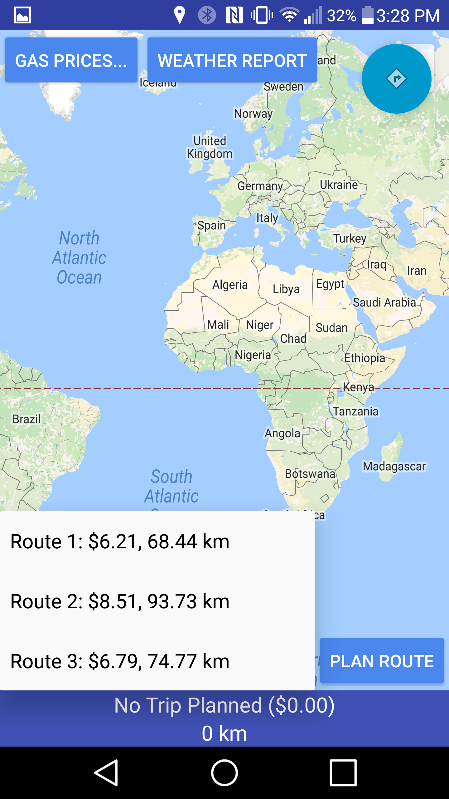
 
**Figure 8:** The options available are set from most optimal to least optimal, but the options presented the top 4 (at most.)

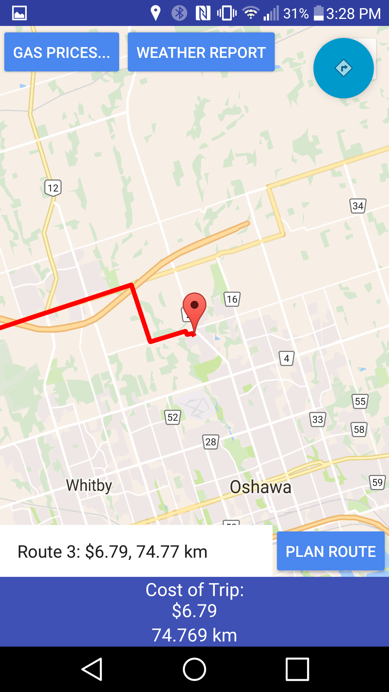
 
**Figure 9:** The user will select one and the map will display the information accordingly. 

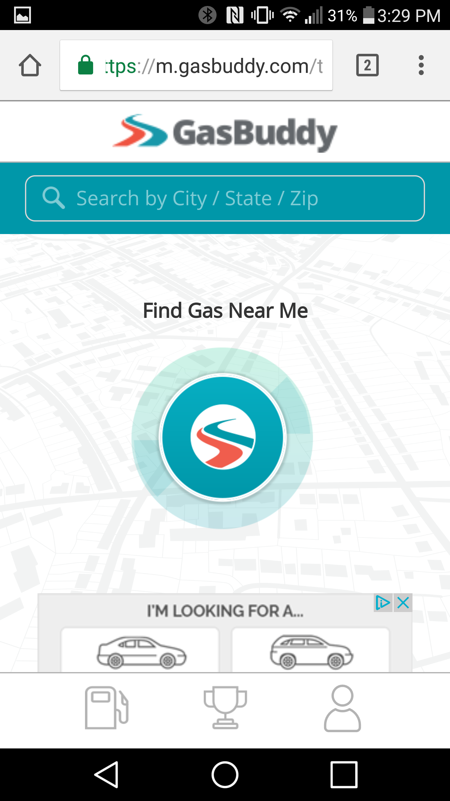
 
**Figure 10:** If the user wishes, they may also get the Gas Price manually from GasBuddy website. The button would automatically take them to the URL. 

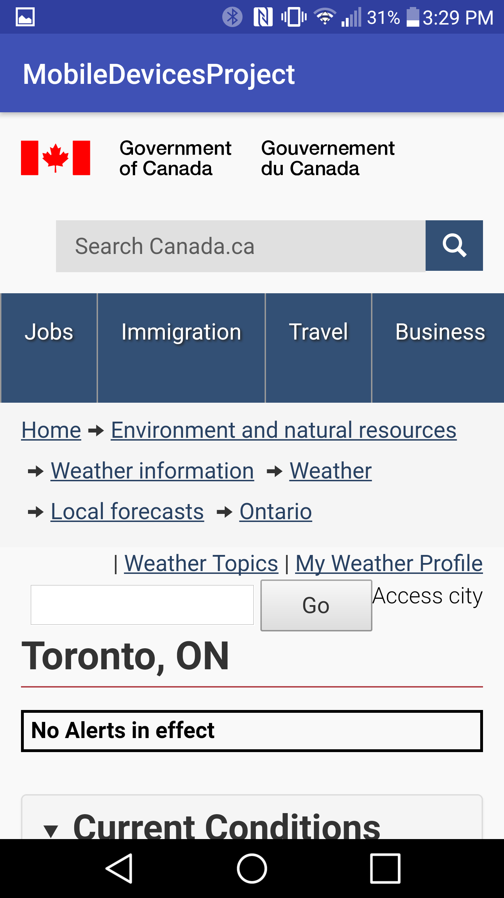
 
**Figure 11:** The user may also be taken to a webview inside the application which would open up a 5 day forecast of the weather. They are also able to interact with the webview as they would inside any browser. 

# Initial Design Implementations

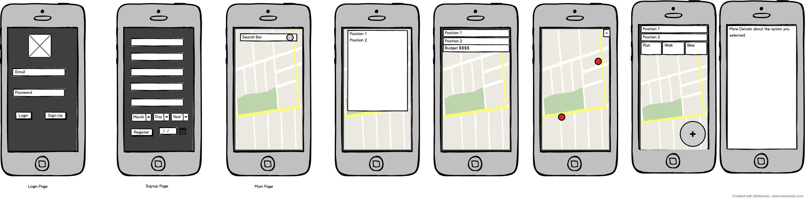
 

**Figure 12:** Initial implementation concept prior to core android development. UXDesign lead by: Mohamad Vedut.
