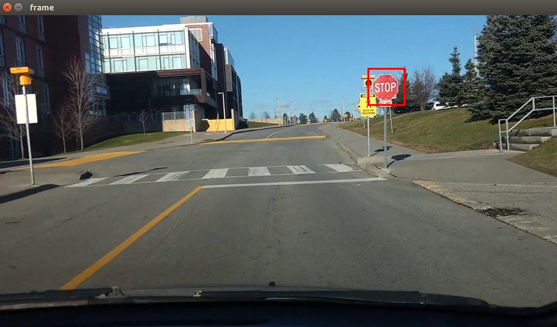
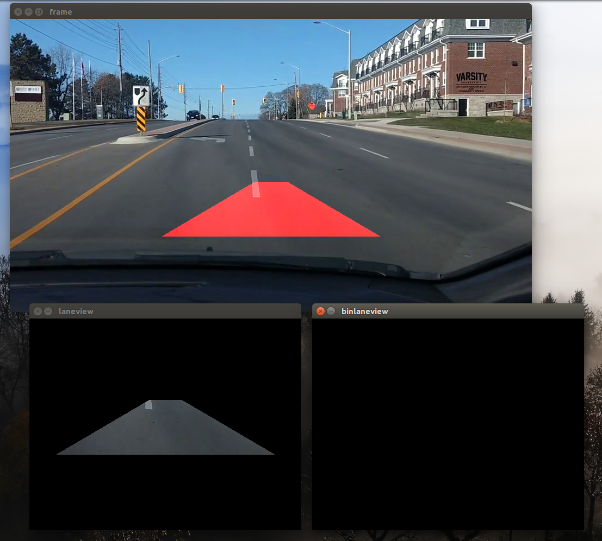
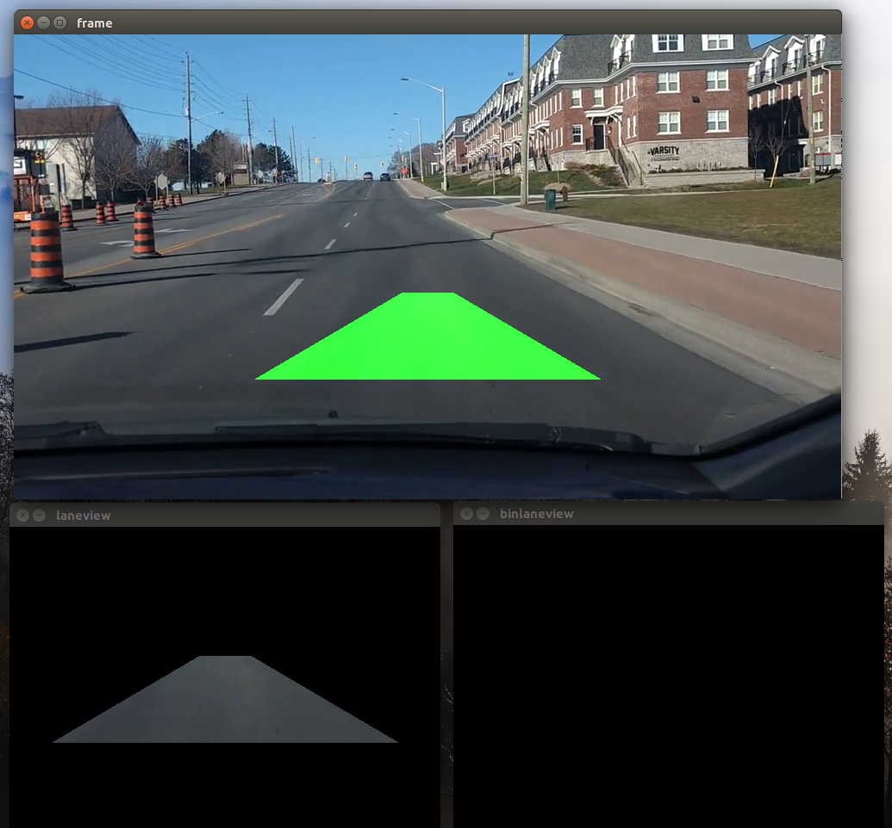

# Machine Learning for Autonomous and Real-time Systems through Image Processing - Vehicle Platform

This AI platform leverages Python libraries and OpenCV have allowed the solution to be capable of understanding signs and vehicles in the environment as an individual is driving. The algorithms process the distance, pixel, size and compare against positive test cases. This display is a successful image processing that has taken place by the solution which allows us in the final demonstration to scale the algorithms on the cloud and process this information in real-time. 

While hazards are a focus in terms of the environment around the vehicle, the algorithms have been extended to recognize not only object like other vehicles and signs, but also to understand whether it is on the lane or not. If the vehicle goes out of range of the road, then it will change its status to red to notify it has gone off the road. So long as the vehicle stays on course in the respective lane, it stays green. 

Camera 1-5 is the full scale implementation of the solution where the placement of the cameras is not relevant or dependent on the success of the solution because all angles are taken into account. The object detectors are event driven components of the algorithm which are constantly pulling data about the three dimensional space around the vehicle which allows it to classify what it is looking at. These x-y-z coordinates are stored and put into a neural network and used to interpret signs, lights, lanes and vehicles surrounding the vehicle.

The algorithms in the final design are hosted on the cloud and in this case Google Cloud Platform which allows for maximum performance, real-time optimization and reliability with processing power to scale to multiple vehicles and the most complicated of environments. 

This information is then processed by distance measuring algorithm which then interprets the distance of that object from the perspective of the vehicle and potential for a hazard should the vehicle the driver is driving continues at the respective speed.

 

The algorithms have a set of positive cases in which it uses to train about what is positive. It then develops a threshold as to which are positive and compares against that threshold which is percentage of accuracy. For example, looking at a stop sign, sometimes the video could be pixelated, the algorithm will approximate whether what it's looking is actually a stop sign which currently has approximately 10% threshold to understanding signs and vehicles. This is built into a neural network to make a decision whether that sign, vehicle lane is what it's looking for and is able to identify it. 

 
Figure 1: Overall Implementation Design

 
Figure 2: Algorithms processing video feed of a vehicle approaching a stop sign. It is able to differentiate and identify the sign and the vehicle, hence the red and blue boxes as outputs.

 
 
Figure 3: Algorithms have been extended to recognize when the vehicle is on the road or when it is off the road, which allows for a positive and negative recognition.

 
 
Figure 4: Algorithms have further expanded to understand the difference in colours when it comes to the traffic lights. This can be leveraged to anticipate the change in lights to make aware about the appropriate times to go, slow down and stop.

 
 
Figure 5: The interfacing mobile and web platform which reads the outputs from Firebase and visualizes the situation on a Google Maps platform while taking into account the speed of the vehicle. 

